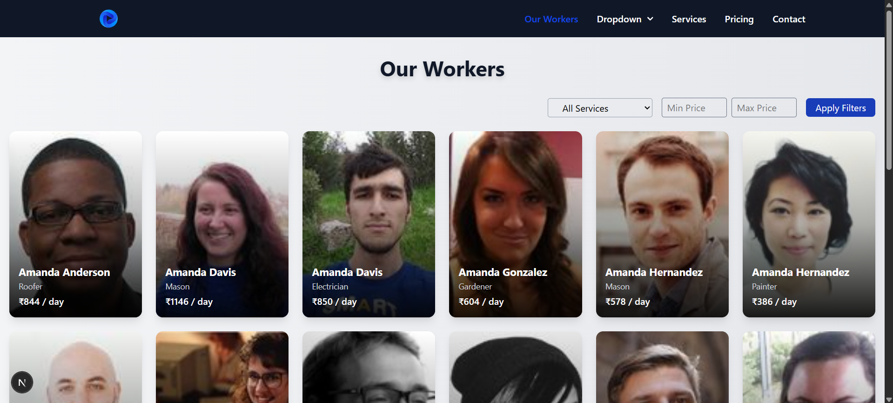
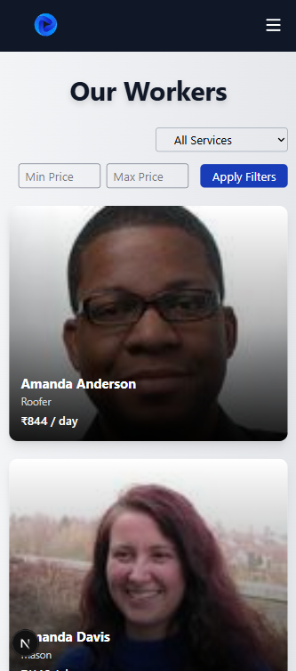

# Frontend Developer Intern Assignment – SolveEase

## Overview

This assignment evaluates practical skills in **React, Next.js, TypeScript, Tailwind CSS**, and **frontend optimizations**. The goal was to enhance an existing Next.js application by resolving layout/design issues, fixing bugs, and implementing requested features for a better user experience.

---
## Deployed Link
```bash
 https://frontend-dev-assignment-gray.vercel.app/
```

Note: External images (Random User API) may not display in deployed version due to server-side fetch restrictions. Images work correctly when running locally.

## Features Implemented

### Cards Layout & Responsiveness
- Fixed the grid layout of worker cards for desktop, tablet, and mobile views.
- Improved card design for enhanced UI/UX.
- Fully responsive design across all screen sizes with smooth animations on hover.

### Sticky Navbar
- Implemented a clean, responsive navigation bar that remains fixed while scrolling.
- Works for desktop and mobile devices.

### Page Load & Performance Optimizations
- **Lazy loading** for images and non-critical components.
- **Memoization** to prevent unnecessary re-renders.
- **Skeleton loading screens** for improved UX during data fetching.

### Pagination & Service Filters
- Pagination added for the workers listing page (9–12 cards per page).
- Filters for **price per day** and **type of service** integrated with pagination.

### API Integration
- Served existing `workers.json` data via `/api/workers` API route.
- Frontend fetches this data using `useEffect` and `fetch`.
- Commented out original static JSON import for reference.
- Implemented:
  - Loading states with skeleton screens.
  - Error handling for failed API requests.
  - Basic memoization to prevent redundant API calls.

### Bug Fixes & Optimizations
- Fixed layout/responsiveness issues in `page.tsx` and other components.
- Resolved console warnings and errors.
- Improved maintainability and readability of code.

---

## Assumptions & Trade-offs

- **Assumptions:**
  - JSON structure provided in the assignment is fixed and should not be altered.
  - Images may not load in production due to Random User API server-side restrictions.

- **Trade-offs / Known Issues:**
  - External Random User images may not display in deployed version (works locally).
  - Some animations (hover effects, skeleton transitions) are minimal to maintain performance.
  - No caching mechanism for API beyond basic memoization.

---

## Screenshots
  
  

---
## Local Setup & Running the Project

### Prerequisites
- **Node.js:** v18.x or higher  
- **npm:** v9.x or higher  

### Steps to Run Locally

1. **Clone the repository**  
```bash
git clone https://github.com/yuvikaKathaith/frontend_dev_assignment.git
cd frontend_dev_assignment
```

2. **Install Dependencies**  
```bash
npm install
```

3. Run locally
```bash
npm run dev
```
Open http://localhost:3000 in your browser.

4. Build for production
```bash 
npm run build
npm start
```

5. Run tests
```bash
npm test
```